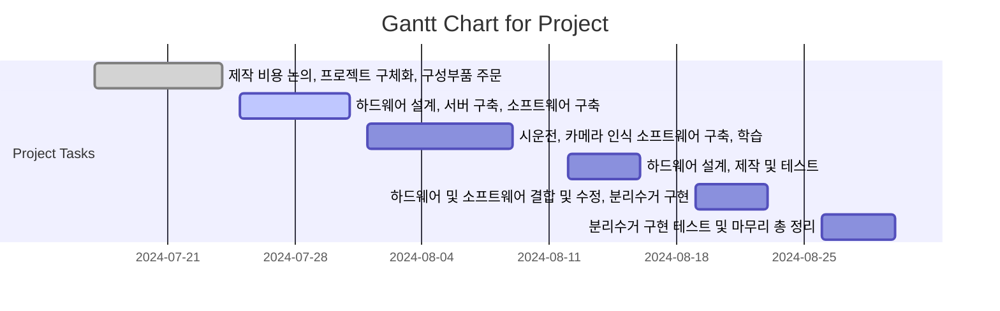

# 분리수거 로봇암 + 자율주행 AGV
 

## 🏆 Goal
> 최대한 간단하고, 빠른 방식으로 프로토타입을 완성하자
 

## 📅  Schedule
> Start: 7/17
> End: 8/31
 

##  💎Milestones
> Step 1. AGV 개발
> Step 2. Robot arm and gripper
> Step 3. CV and entire walking simulation
 

## ✅Tasks
- [ ] 7/17 ~ 7/28 -> 제작 비용 논의, 프로젝트 구체화, 구성부품 주문
- [ ] 7/29 ~ 8/3 -> 하드웨어 설계, 서버 구축, 소프트웨어 구축
- [ ] 8/4 ~ 8/15 -> 시운전, 카메라 인식 소프트웨어 구축, 학습
- [ ] 8/16 ~ 8/20 -> 하드웨어 설계, 제작 및 테스트
- [ ] 8/21 ~ 8/26 -> 하드웨어 및 소프트웨어 결합 및 수정, 분리수거 구현
- [ ] 8/26 ~ 8/30 -> 분리수거 구현 테스트 및 마무리 총 정리
 

## 📊 Schedule
> 전반적인 Task

 

## Reference
[[Python]], [[ComputerVision]], [[Fusion360]], [[Robotics and AI]]