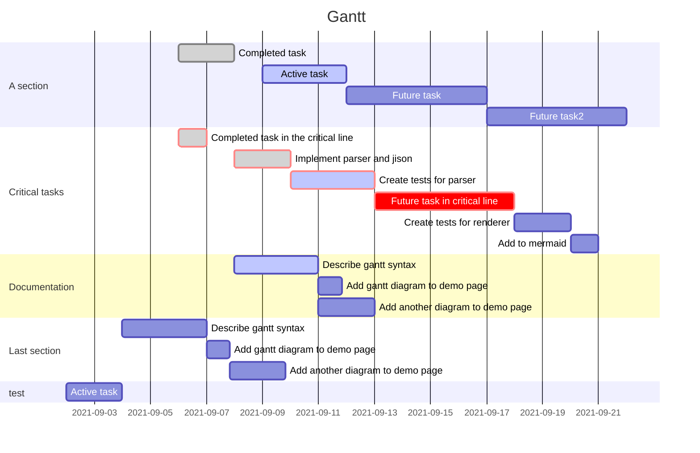

# Side Project before starting main project
## 🏆 Goal
> 최대한 간단하고, 빠른 방식으로 프로토타입을 완성하자

## 📅  Schedule
> Start: 7/17
> End: 8/31

##  💎Milestones
> Step 1. AGV 개발
> Step 2. Robot arm and gripper
> Step 3. CV and entire walking simulation

## ✅Tasks
- 7/17 ~ 7/24 -> 제작 비용 논의, 프로젝트 구체화, 구성부품 주문
- 7/25 ~ 7/31 -> 하드웨어 설계, 서버 구축, 소프트웨어 구축
- 8/1 ~ 8/9 -> 시운전, 카메라 인식 소프트웨어 구축, 학습
- 8/12 ~ 8/16 -> 하드웨어 설계, 제작 및 테스트
- 8/19 ~ 8/23 -> 결합 및 수정 설계, 하드웨어 및 소프트웨어 

## 📊 Gantt
> 스케쥴을 바탕으로 Gantt 차트를 작성한다.

---
## Reference

출처: [https://olait.tistory.com/10](https://olait.tistory.com/10) [이토록 쉬운 옵시디언:티스토리]